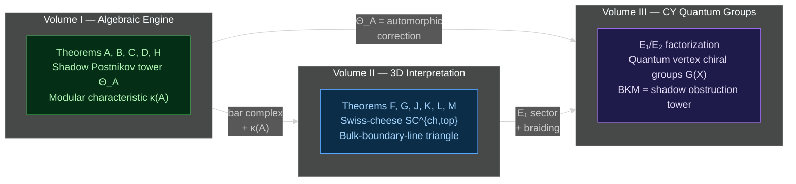
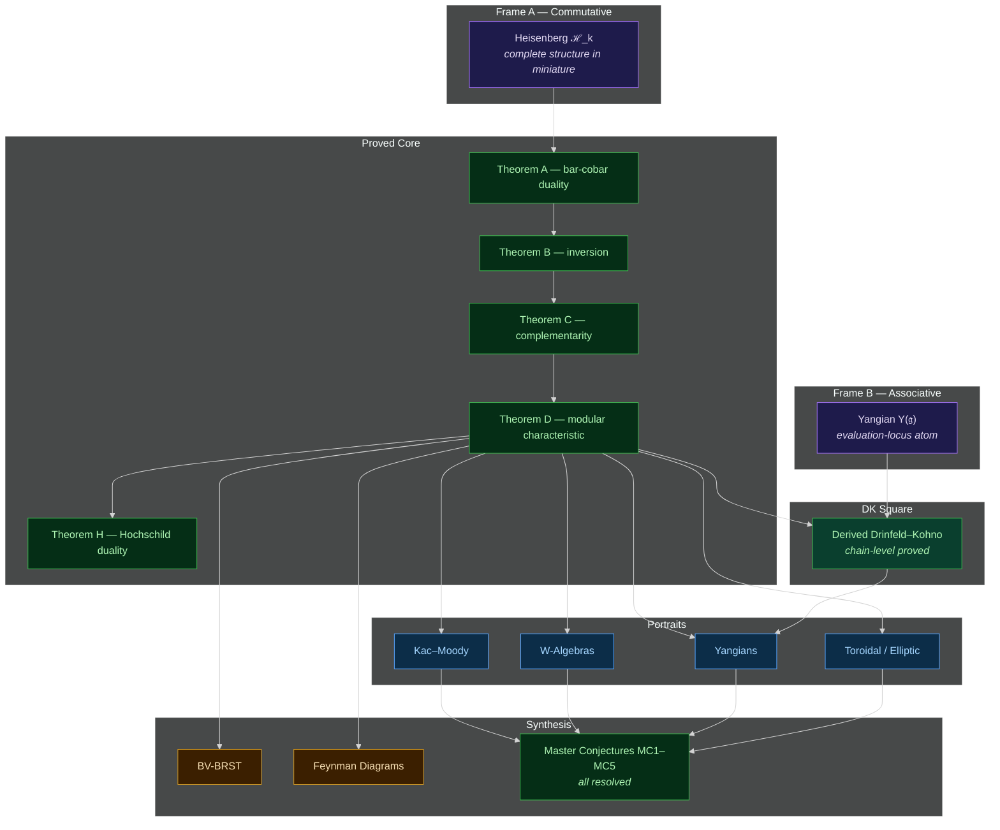

<div align="center">

<br>

# Modular Homotopy Theory for Algebraic Factorization Algebras on Algebraic Curves

### Volume 1: Modular Koszul Duality

<br>

*Logarithmic forms on Fulton&hairsp;-&hairsp;MacPherson compactifications act as diffracting prisms,*
*decomposing chiral algebras across their operadic spectrum.*

<br>


<br>


<br>

</div>

---

<br>

## Overview

This monograph constructs a geometric lift of classical Koszul duality (the bar-cobar adjunction) from operads to chiral algebras, using configuration space integrals on algebraic curves. The result is a duality theory for vertex algebras that unifies operadic algebra, moduli space geometry, and conformal field theory.

**In one sentence.** &ensp; The bar complex of a chiral algebra is computed by integration over Fulton&ndash;MacPherson compactifications; Verdier duality interchanges bar and cobar; and the failure of nilpotence at genus $g \geq 1$ is controlled by a single scalar invariant $\kappa(\mathcal{A})$ that organizes the quantum corrections across all genera.

The monograph is approximately half theory, half examples. Five main theorems (A, B, C, D, H) form the proved core. Five master conjectures (MC1&ndash;MC5) define the research frontier; MC1&ndash;MC5 are all resolved. The organizing structure is the **modular convolution L<sub>&infin;</sub>-algebra** &mdash; a single chain-level object built from three inputs: Malikov&ndash;Schechtman homotopy chiral algebras, Mok&rsquo;s logarithmic Fulton&ndash;MacPherson compactifications, and Robert-Nicoud&ndash;Wierstra convolution functoriality. The universal Maurer&ndash;Cartan element &Theta;<sub>A</sub> = &sum;<sub>&Gamma;</sub> |Aut(&Gamma;)|<sup>&minus;1</sup> W<sub>&Gamma;</sub><sup>logFM</sup> &otimes; &Phi;<sub>&Gamma;</sub><sup>A</sup> is a stable-graph sum with log-FM weights and Ch<sub>&infin;</sub>-vertex labels. Its finite-order projections constitute the **shadow Postnikov tower** &mdash; the modular characteristic &kappa; at arity 2, the cubic shadow at arity 3, the quartic resonance class at arity 4 &mdash; while the **modular tangent complex** T<sup>mod</sup><sub>&Theta;<sub>A</sub></sub> recovers &kappa;, &Delta;<sub>A</sub>, and R<sup>mod</sup><sub>4</sub> as successive Chern&ndash;Weil projections of a single modular connection.

<br>

## The Three-Volume Programme

This monograph is Volume I of a three-volume programme. The volumes are logically ordered: Volume I builds the algebraic engine, Volume II reads its output in three dimensions, and Volume III identifies the engine's shadow obstruction tower with the automorphic correction of BKM superalgebras arising from Calabi&ndash;Yau categories.

| &ensp; | Volume | Title | Scope |
|:---:|:------:|-------|-------|
| **I** | [chiral-bar-cobar](https://github.com/raeez/chiral-bar-cobar) | *Modular Koszul Duality* | The algebraic engine. Bar-cobar for chiral algebras on curves. |
| **II** | [chiral-bar-cobar-vol2](https://github.com/raeez/chiral-bar-cobar-vol2) | *A<sub>&infin;</sub> Chiral Algebras and 3D HT QFT* | The 3D interpretation. Swiss-cheese SC<sup>ch,top</sup>. PVA descent. |
| **III** | [calabi-yau-quantum-groups](https://github.com/raeez/calabi-yau-quantum-groups) | *Calabi&ndash;Yau Quantum Groups* | CY categories as quantum chiral algebras. |

<br>



<br>

<details>
<summary><b>Volume I</b> &ensp; <i>Modular Koszul Duality</i> &ensp; (this repository)</summary>

&nbsp;

The algebraic engine. Constructs bar-cobar duality for chiral algebras via configuration space integrals on Fulton&ndash;MacPherson compactifications. Five main theorems (A&ndash;D, H) form the proved core. The universal Maurer&ndash;Cartan element &Theta;<sub>A</sub> and its finite-order projections (the shadow Postnikov tower) organize the full modular structure.

| Metric | Value |
|--------|------:|
| Pages | ~2,350 |
| Tagged claims | 3,344 |
| Compute tests | 48,046 |
| Commits | 815+ |
| Source files | 111 `.tex`, 312K lines |
| Compute modules | 581 lib + 631 test files |

</details>

<details>
<summary><b>Volume II</b> &ensp; <i>A<sub>&infin;</sub> Chiral Algebras and 3D Holomorphic&ndash;Topological QFT</i></summary>

&nbsp;

The three-dimensional interpretation. The bar differential is &Copf;-direction factorization; the coproduct is &Ropf;-direction factorization; together they make a Swiss-cheese algebra on FM<sub>k</sub>(&Copf;)&ensp;&times;&ensp;Conf<sub>k</sub>(&Ropf;). Six main theorems (F, G, J, K, L, M) covering homotopy-Koszulity of SC<sup>ch,top</sup>, PVA descent, the bulk-boundary-line triangle, curved Swiss-cheese at genus&ensp;&geq;&ensp;1, deformation braces, and modular PVA quantization.

| Metric | Value |
|--------|------:|
| Pages | ~1,480 |
| Tagged claims | ~2,410 |
| Commits | 357 |
| Source files | 99 `.tex`, 182K lines |

</details>

<details>
<summary><b>Volume III</b> &ensp; <i>Calabi&ndash;Yau Quantum Groups</i></summary>

&nbsp;

CY categories as quantum chiral algebras via E<sub>1</sub>/E<sub>2</sub> factorization. The combinatorial skeleton of a CY threefold&hairsp;&mdash;&hairsp;its lattice, BPS spectrum, and symmetries&hairsp;&mdash;&hairsp;is the root datum of a quantum vertex chiral group G(X). The bar-complex Euler product is the BKM denominator identity. CY3 combinatorics are generalized root data.

| Metric | Value |
|--------|------:|
| Pages | ~70 (main) |
| Compute tests | ~1,600 |
| Compute modules | 21 lib + 24 test files |

</details>

<br>

## What Volume III Revealed About Volume I

The central observation of Volume III is that the shadow Postnikov tower &Theta;<sub>A</sub> from this volume&hairsp;&mdash;&hairsp;the universal Maurer&ndash;Cartan element organizing all modular corrections&hairsp;&mdash;&hairsp;has the same algebraic structure as the automorphic correction of a Borcherds&ndash;Kac&ndash;Moody superalgebra when applied to CY3 categories. This is a **conjectural identification**, not a theorem: the BKM algebra g<sub>&Delta;<sub>5</sub></sub> exists (Gritsenko&ndash;Nikulin), but the chiral algebra A<sub>K3&times;E</sub> that would feed into the Vol&nbsp;I machine does not yet exist. The central obstruction is Conjecture CY-A<sub>3</sub> (the CY-to-chiral functor at d&nbsp;=&nbsp;3).

The conjectural identification is arity-by-arity:

| Arity | Shadow obstruction tower (Vol&nbsp;I) | BKM algebra (Vol&nbsp;III) | BPS physics |
|:-----:|:------------|:-----------|:-----------|
| 2 | &kappa;(&Ascr;) &ensp;(modular characteristic) | Real roots + Weyl vector | Perturbative spectrum |
| 3 | Cubic shadow *C* | First imaginary roots | 3-body bound states |
| 4 | Quartic shadow *Q* | Deeper imaginary roots | 4-body bound states |
| &infin; | Full &Theta;<sub>A</sub> | Complete BKM 𝔤<sub>X</sub> | Full non-perturbative BPS |

The **denominator identity** of the BKM superalgebra has the same algebraic structure as the **bar-complex Euler product**:

$$\Phi_X(z) \;=\; e^{-2\pi i\langle\rho,z\rangle} \prod_{\alpha \in \Delta_+} \bigl(1 - e^{-2\pi i\langle\alpha,z\rangle}\bigr)^{\mathrm{mult}(\alpha)}$$

For K3&ensp;&times;&ensp;E, this is the Igusa cusp form &Delta;<sub>5</sub> with root multiplicities from the K3 elliptic genus &phi;<sub>0,1</sub>.

This pattern was computationally verified at arities 2&ndash;6 for K3&ensp;&times;&ensp;E across 271 dedicated BKM tests. The closed verification loop:

```
K3 geometry  -->  Vafa-Witten invariants  -->  DMVV formula  -->  φ_{0,1} coefficients
     |                                                                    |
     |                                                                    v
     +---  DT partition function  <---  Δ_5  <---  Borcherds product
                                          |
                                          v
                                    BKM root multiplicities  ≅?  shadow obstruction tower
```

The implication for this volume, if the identification is correct: the abstract algebraic engine of bar-cobar duality&hairsp;&mdash;&hairsp;the shadow obstruction tower, the modular characteristic, the Maurer&ndash;Cartan equation&hairsp;&mdash;&hairsp;is not merely a formal organizational device but the automorphic structure of BPS state counting in string theory. The five theorems proved here would then be the algebraic skeleton of a BKM superalgebra whose denominator identity is an automorphic form. This motivates the construction of the d&nbsp;=&nbsp;3 CY-to-chiral functor as the central open problem of the programme.

<br>

## The Double-Frame Architecture

The theory has two complementary entry points&hairsp;&mdash;&hairsp;two "frame atoms" that together generate the full structure.

| &ensp; | Frame A &ensp;(*commutative*) | Frame B &ensp;(*associative*) |
|:---:|------|------|
| **Atom** | Heisenberg algebra $\mathcal{H}_k$ | Yangian evaluation locus $Y(\mathfrak{g})$ |
| **Operad** | $E_\infty$-chiral (commutative, fully local) | $E_1$-chiral (associative, ordered) |
| **Config. spaces** | Unordered &ensp;$C_n(X)$ | Ordered &ensp;$\mathrm{Conf}_n(X)$ |
| **Duality arrow** | Level inversion &ensp;$k \mapsto -k - 2h^\vee$ | $R$-matrix inversion &ensp;$q \mapsto q^{-1}$ |
| **Theorems** | A, B, C, D, H &ensp;(modular + Hochschild package) | Derived Drinfeld&ndash;Kohno square |
| **Status** | **Proved** | Chain-level **proved**; factorization-categorical extension **open** |

The two frames meet in the **derived Drinfeld&ndash;Kohno square**: a commutative diagram whose top arrow is bar-cobar duality (level inversion), whose bottom arrow is $R$-matrix inversion ($q \mapsto q^{-1}$), and whose vertical arrows are Kazhdan&ndash;Lusztig equivalences. The scalar modular characteristic $\kappa + \kappa^! = 0$ is the trace of this square.

<br>

## The Three-Pillar Chain-Level Engine

The modular convolution algebra is built from three recent structural inputs:

| Pillar | Source | Mathematical role | Manuscript integration |
|:------:|--------|-------------------|----------------------|
| **A** | Malikov&ndash;Schechtman&ensp;(2024) | Homotopy chiral algebra Ch<sub>&infin;</sub>: primitive local object | Vertex labels &Phi;<sub>&Gamma;</sub><sup>A</sup> |
| **B** | Robert-Nicoud&ndash;Wierstra&ensp;(2019)&ensp;+&ensp;Vallette&ensp;(2016) | Convolution sL<sub>&infin;</sub>-algebra hom<sub>&alpha;</sub>(C, A) | L<sub>&infin;</sub> structure + MC&ensp;&simeq;&ensp;Tw |
| **C** | Mok&ensp;(2025) | Log FM compactification FM<sub>n</sub>(X&thinsp;&#124;&thinsp;D) | Chain propagators W<sub>&Gamma;</sub><sup>logFM</sup> + clutching |

The graphwise cocomposition &Delta;<sup>log</sup><sub>&Gamma;</sub>&ensp;:=&ensp;(&nu;<sub>&Gamma;</sub>)<sub>&ast;</sub>&ensp;&compfn;&ensp;Res<sub>D<sup>log</sup><sub>&Gamma;</sub></sub> decomposes the cooperadic structure over rigid stable graphs, yielding Taylor coefficients &ell;<sub>k</sub><sup>(g)</sup>&ensp;=&ensp;&sum;<sub>&Gamma;</sub>&ensp;|Aut(&Gamma;)|<sup>&minus;1</sup>&ensp;&ell;<sub>&Gamma;</sub>. The boundary operators d<sub>sew</sub>, d<sub>pf</sub>, &hbar;&Delta; are residue correspondences on separating, planted-forest, and non-separating strata respectively; D<sup>2</sup>&ensp;=&ensp;0 is the cancellation of codimension-2 faces in Mok&rsquo;s normal-crossings compactification.

The **depth filtration** assigns every coefficient of &Theta;<sub>A</sub> a tridegree (g,&thinsp;n,&thinsp;d)&ensp;=&ensp;(loop genus,&ensp;arity,&ensp;logarithmic boundary depth). The **genus spectral sequence** from the genus filtration on L<sub>mod</sub> has differentials that are the successive obstruction maps Ob<sub>g</sub>&ensp;&mdash;&ensp;distinct from the PBW spectral sequence, which uses conformal weight within each fixed genus.

<br>

### Five Irreducible Pieces

Every construction in the monograph decomposes into exactly five irreducible ingredients:

| # | Ingredient | Mathematical realization | Where |
|:-:|------------|--------------------------|-------|
| **(i)** | Arnold relation | $\eta_{ij} \wedge \eta_{jk} + \eta_{jk} \wedge \eta_{ki} + \eta_{ki} \wedge \eta_{ij} = 0$ &ensp;$\Rightarrow$&ensp; $d^2 = 0$ | Both frames |
| **(ii)** | Verdier duality on Ran$(X)$ | $\mathbb{D}_{\mathrm{Ran}}\, \bar{B}(\mathcal{A}) \simeq \bar{B}(\mathcal{A}^!)$ | Frame A |
| **(iii)** | Genus-1 curvature | $d_{\mathrm{fib}}^2 = \kappa \cdot \omega_g$ &ensp;(Hodge class obstruction) | Frame A |
| **(iv)** | Clutching / sewing | Modular operad composition via $\partial \overline{\mathcal{M}}_g$ | Frame A |
| **(v)** | Ordered factorization | $E_1$ structure from ordered configuration spaces | Frame B |

Frame A uses (i)&ndash;(iv). Frame B uses (i), (ii), (v). The five together generate the full theory.

<br>

## Five Main Theorems

| &ensp; | Theorem | Statement |
|:---:|---------|-----------|
| **A** | **Geometric Bar-Cobar Duality** | Bar and cobar functors via configuration space integrals form an adjoint pair. For Koszul chiral algebras, the adjunction is an equivalence. |
| **B** | **Bar-Cobar Inversion** | $\Omega^{\mathrm{ch}} \circ \bar{B}\_{\mathrm{geom}} \simeq \mathrm{id}$ on the Koszul locus, via spectral sequence collapse at $E_2$. |
| **C** | **Deformation-Obstruction Complementarity** | $Q_g(\mathcal{A}) \oplus Q_g(\mathcal{A}^!) \;\simeq\; H^\*(\overline{\mathcal{M}}_g,\, Z(\mathcal{A}))$. &ensp;What one algebra sees as deformation, its dual sees as obstruction. |
| **D** | **Modular Characteristic** | A single invariant $\kappa(\mathcal{A})$ controls the scalar modular package across all genera: universal, additive under $\otimes$, antisymmetric under duality ($\kappa + \kappa^! = 0$), with generating function the $\hat{A}$-genus. |
| **H** | **Hochschild Duality** | $\mathrm{ChirHoch}^n(\mathcal{A}) \cong \mathrm{ChirHoch}^{2-n}(\mathcal{A}^!)^\vee \otimes \omega_X$. &ensp;Polynomial growth of chiral Hochschild cohomology on the Koszul locus. |

<br>

### Theorem Architecture

The five main theorems decompose into a finer proved structure.

| Component | Name | Content |
|:---------:|------|---------|
| **A<sub>0</sub>** | Fundamental twisting morphisms | Four-way equivalence: twisting morphisms, bar, cobar, Koszul duality |
| **A<sub>1</sub>** | Bar concentration | $H^{p,q}(\bar{B}(\mathcal{A})) = 0$ for $q \neq 0$ on the Koszul locus |
| **A<sub>2</sub>** | Verdier intertwining | $\mathbb{D}\_{\mathrm{Ran}}\, \bar{B}(\mathcal{A}) \simeq \bar{B}(\mathcal{A}^!)$ |
| **B** | Higher-genus inversion | Quasi-isomorphism on Koszul locus; coderived persistence off it |
| **C<sub>0</sub>** | Fiber-center identification | $R^q \pi_\* \bar{B}_g = 0$ for $q \neq 0$;&ensp; $R^0 \pi_\* \simeq Z(\mathcal{A})$ |
| **C<sub>1</sub>** | Complementarity | Lagrangian polarization of the genus-$g$ correction space |
| **D<sub>scal</sub>** | Scalar characteristic | $\kappa(\mathcal{A})$ determines the full scalar modular package |
| **D<sub>&Delta;</sub>** | Spectral characteristic | Spectral discriminant $\Delta_{\mathcal{A}}(x)$ from quadratic OPE data |
| **H** | Hochschild duality | $\mathrm{ChirHoch}^\*(\mathcal{A})$ polynomial, dual to $\mathrm{ChirHoch}^\*(\mathcal{A}^!)$ |

<br>

## Proof Status

The monograph is a two-stratum work.

> **Stratum I&ensp;&mdash;&ensp;proved.**&ensp; Theorems A/B/C/D/H, chain-level Drinfeld&ndash;Kohno (DK-0 through DK-3 on the evaluation-generated core, all simple types), all-genera PBW concentration for Kac&ndash;Moody / Virasoro / $\mathcal{W}_N$, cyclic $L_\infty$ deformation theory and universal $\Theta_{\mathcal{A}}$, prefundamental Clebsch&ndash;Gordan for $Y(\mathfrak{sl}_2)$ thick generation (MC3).
> &ensp; 4,944 proved claims&ensp;(4,213 here&hairsp;+&hairsp;731 elsewhere).&ensp; Every claim has a machine-readable status tag.

> **Stratum II&ensp;&mdash;&ensp;programme.**&ensp; Coderived Ran-space extension beyond the evaluation-generated core, factorization-categorical DK/KL completion (MC3 for arbitrary Dynkin type), completed bar for infinite-generator towers ($\mathcal{W}_\infty$, Yangian).
> &ensp; 329 precisely scoped conjectures; all five master conjectures resolved.

<br>

### Five Master Conjectures

All conjectured claims trace to one of five master conjectures. All five are resolved; the remaining frontier is MC3 extension to arbitrary Dynkin type.

| &ensp; | Target | Status | Impact |
|:---:|--------|--------|--------|
| **MC1** | Higher-genus PBW degeneration | **Proved**&ensp;(all standard families) | Unconditional interacting families |
| **MC2** | Universal &Theta;<sub>A</sub>&ensp;(bar-intrinsic construction) | **Proved**&ensp;(&Theta;<sub>A</sub>&ensp;:=&ensp;D<sub>A</sub>&ensp;&minus;&ensp;d<sub>0</sub>) | Full modular curvature machine |
| **MC3** | Thick generation / DK duality | **Proved in type A**&ensp;(chromatic + CG + Efimov); arbitrary type **open** | Quantum groups |
| **MC4** | Completed bar-cobar towers | **Proved**&ensp;(strong completion theorem); MC4<sup>+</sup> solved, MC4<sup>0</sup> finite resonance | Infinite-generator algebras |
| **MC5** | BV-BRST = bar at all genera | **Proved**&ensp;(inductive genus determination + 2D convergence + HS-sewing for standard landscape) | Analytic partition functions |

<br>

### Modular Characteristic Hierarchy

The modular invariants form a three-level hierarchy, each proved at its own level:

| Level | Invariant | Content | Status |
|:-----:|-----------|---------|:------:|
| **Scalar** | $\kappa(\mathcal{A})$ | Single number: controls all genera via $\mathrm{obs}_g = \kappa \cdot \lambda_g$. Universal, additive, antisymmetric. | **Proved** |
| **Spectral** | $\Delta_{\mathcal{A}}(x)$ | Polynomial: discriminant from quadratic OPE data. Detects non-scalar structure. | **Proved** |
| **Full** | $\Theta_{\mathcal{A}}$ | Maurer&ndash;Cartan class in cyclic deformation complex. Recovers $\kappa$ and $\Delta$ as shadows. | **Proved**&ensp;(MC2) |

<br>

### Further Structural Results

| Result | Statement | Reference |
|--------|-----------|-----------|
| **Koszulness meta-theorem** | 12 equivalent characterizations of chiral Koszulness&ensp;&mdash;&ensp;11 unconditionally proved + 1 conditional (Lagrangian criterion, pending perfectness/nondegeneracy hypotheses). Includes A<sub>&infin;</sub>-formality, shadow-formality, E<sub>2</sub>-formality, Barr&ndash;Beck&ndash;Lurie, FH concentration, FM boundary acyclicity, tropical, Lagrangian criterion. | `thm:koszul-equivalences-meta` |
| **HS-sewing criterion** | Polynomial OPE growth + subexponential sector growth implies Hilbert&ndash;Schmidt sewing for all $0 < q < 1$. Covers the entire standard landscape. | `thm:general-hs-sewing` |
| **Heisenberg sewing theorem** | The sewing envelope of the Heisenberg VOA has partition function equal to a Fredholm determinant. First decisive case of the analytic completion programme. | `thm:heisenberg-sewing` |
| **Inductive genus determination** | The genus-$g$ component $\Theta^{(g)}$ of the universal MC element is determined by lower genera. | `thm:inductive-genus-determination` |
| **2D convergence** | Graph amplitudes on $\Sigma_g$ converge without UV renormalization. | `prop:2d-convergence` |
| **Analytic-algebraic comparison** | $D^{\mathrm{an},g} = D^{\mathrm{alg},g}$ on the algebraic core: analytic and algebraic bar differentials coincide. | `thm:analytic-algebraic-comparison` |

<br>

## Architecture



<br>

## Quick Start

### Reading the manuscript

```bash
# Build the PDF (requires TeX Live 2024+ with pdflatex)
make fast                    # quick build (up to 4 passes)
open main.pdf                # 2,352 pages
```

**Entry point**: `main.tex` &rarr; `main.pdf`. Start reading at the **Introduction** (Chapter 2), which states the five main theorems and the Leitfaden. The **Heisenberg frame** (Chapter 1) shows the entire theory in a single computable example.

### Suggested reading paths

| Goal | Path |
|------|------|
| **Core theory** | Ch 1 (frame) &rarr; Ch 2 (introduction) &rarr; Ch 5 (config spaces) &rarr; Ch 6 (bar-cobar) &rarr; Ch 8 (higher genus) |
| **Examples first** | Ch 1 &rarr; Ch 19 ($\beta\gamma$) &rarr; Ch 20 (Kac&ndash;Moody) &rarr; Ch 21 ($\mathcal{W}$-algebras) &rarr; Ch 6 (theory) |
| **Quantum groups** | Ch 1 &rarr; Ch 24 (Yangians) &rarr; Ch 20 (KM, KL regime) &rarr; Ch 34 (concordance) |
| **Physics** | Ch 1 &rarr; Ch 29 (Feynman) &rarr; Ch 30 (BV-BRST) &rarr; Ch 31 (holomorphic-topological) |
| **Frontier** | Ch 34 (concordance &mdash; the "constitution") &rarr; MC3 arbitrary type, Koszulness programme, analytic sewing |

<br>

## Repository Layout

```
chiral-bar-cobar/
├── main.tex                            entry point (preamble + \include's)
├── Makefile                            build system (15 targets)
├── chapters/
│   ├── frame/                          Heisenberg as frame example (1 file)
│   ├── theory/                         core theory (~54K lines)
│   ├── examples/                       complete portraits (~43K lines)
│   └── connections/                    synthesis and programme (~10K lines)
├── appendices/                         reference appendices (~8K lines)
├── bibliography/references.tex         255 entries
├── compute/                            Python verification engine
│   ├── lib/                            486 library modules
│   └── tests/                          540 test files (~39K tests)
├── metadata/                           machine-readable census, claims, dependency graph
├── notes/                              session prompts, programmes, research notes
└── scripts/                            build and QC automation
```

<details>
<summary><b>Frame</b> &ensp; <code>chapters/frame/</code></summary>

&nbsp;

| File | Lines | Subject |
|------|------:|---------|
| `heisenberg_frame.tex` | 2,698 | The Heisenberg algebra as the complete structure in miniature. Demonstrates all five main theorems, the modular characteristic, and the double-frame architecture in a single computable example. |

</details>

<details>
<summary><b>Theory</b> &ensp; <code>chapters/theory/</code> &ensp; ~54K lines</summary>

&nbsp;

| File | Lines | Subject |
|------|------:|---------|
| `introduction.tex` | 1,145 | Main results, Leitfaden, double-frame architecture, $E_1 / E_\infty$ dictionary |
| `algebraic_foundations.tex` | 1,164 | Classical Koszul duality, operads, Weiss covers |
| `configuration_spaces.tex` | 3,281 | $C_n(X)$, FM compactification, Arnold&ndash;Orlik&ndash;Solomon algebra |
| `bar_cobar_construction.tex` | 13,105 | Geometric bar/cobar functors, $d^2=0$, Verdier pairing, coalgebra homological algebra |
| `poincare_duality.tex` | 729 | Non-abelian Poincar&eacute; duality, bar-computes-dual |
| `poincare_duality_quantum.tex` | 909 | Quantum corrections via modular operad, Feynman transform |
| `higher_genus.tex` | 15,364 | Genus-$g$ bar complex, Theorems B + C, Kodaira&ndash;Spencer map |
| `chiral_koszul_pairs.tex` | 3,039 | Koszul pair theory, chiral Koszulness criteria, PBW criterion |
| `koszul_pair_structure.tex` | 1,716 | Pair classification, periodicity |
| `chiral_modules.tex` | 4,904 | Module categories, representation theory, $E_1$ module Koszul duality |
| `deformation_theory.tex` | 3,995 | Deformation-obstruction theory, curved $A_\infty$ |
| `hochschild_cohomology.tex` | 818 | Chiral Hochschild and cyclic cohomology |
| `en_koszul_duality.tex` | 924 | $E_n$ Koszul duality, higher-dimensional propagators |
| `derived_langlands.tex` | 1,082 | Derived Langlands, critical-level oper bar |
| `fourier_seed.tex` | 1,011 | Fourier seed construction |

</details>

<details>
<summary><b>Examples</b> &ensp; <code>chapters/examples/</code> &ensp; ~43K lines</summary>

&nbsp;

| File | Lines | Subject |
|------|------:|---------|
| `lattice_foundations.tex` | 4,025 | Lattice VOA engine |
| `free_fields.tex` | 4,134 | Heisenberg, free fermion, $bc$ system |
| `beta_gamma.tex` | 1,334 | Symplectic bosons, $\beta\gamma$ bar complex |
| `heisenberg_eisenstein.tex` | 904 | Heisenberg genus expansion, Eisenstein series |
| `kac_moody_framework.tex` | 2,912 | Affine Kac&ndash;Moody: screening, Wakimoto, admissible levels, Kazhdan&ndash;Lusztig |
| `w_algebras_framework.tex` | 2,206 | $\mathcal{W}$-algebra Koszul duality, logarithmic extensions |
| `w3_composite_fields.tex` | 1,011 | $\mathcal{W}_3$ composite $\Lambda$ field, null vectors, Kac determinant |
| `w_algebras_deep.tex` | 1,621 | $\mathcal{W}_3$ bar complex, Bershadsky&ndash;Polyakov, DS hierarchy |
| `minimal_model_fusion.tex` | 785 | Verlinde formula, fusion rules, modular tensor categories |
| `minimal_model_examples.tex` | 495 | Ising, tricritical Ising, three-state Potts |
| `deformation_quantization.tex` | 1,108 | Chiral Kontsevich formality, star products |
| `deformation_examples.tex` | 574 | Deformation examples |
| `yangians.tex` | 11,074 | Drinfeld Yangians, $E_1$ Koszul duality, DK square, $\infty$-categorical factorization KD |
| `toroidal_elliptic.tex` | 1,277 | Double affine algebras, elliptic $R$-matrix, Fay identity |
| `genus_expansions.tex` | 2,687 | All-genera expansions: $\widehat{\mathfrak{sl}}_2$, Virasoro, $\mathcal{W}_3$, genus-2 |
| `detailed_computations.tex` | 4,351 | Degree-by-degree tables through weight 5 |
| `examples_summary.tex` | 2,574 | Master Table of Computed Invariants |

</details>

<details>
<summary><b>Connections</b> &ensp; <code>chapters/connections/</code> &ensp; ~10K lines</summary>

&nbsp;

| File | Lines | Subject |
|------|------:|---------|
| `poincare_computations.tex` | 282 | Non-abelian Poincar&eacute; duality computations |
| `feynman_diagrams.tex` | 1,218 | Feynman diagram interpretation of bar differentials |
| `feynman_connection.tex` | 283 | Feynman&ndash;configuration space bridge |
| `bv_brst.tex` | 1,490 | BV-BRST formalism: bar = BRST at genus 0 |
| `holomorphic_topological.tex` | 835 | Holomorphic-topological theories, AGT correspondence |
| `physical_origins.tex` | 178 | 4d/2d, D-branes, non-commutative Chern&ndash;Simons |
| `kontsevich_integral.tex` | 521 | Kontsevich integral, Vassiliev invariants, Chern&ndash;Simons bridge |
| `genus_complete.tex` | 599 | Universal genus tower, Eynard&ndash;Orantin recursion |
| `concordance.tex` | 4,954 | Literature concordance, status ledger, MC1&ndash;MC5 roadmaps (the "constitution") |

</details>

<details>
<summary><b>Appendices</b> &ensp; <code>appendices/</code> &ensp; ~8K lines</summary>

&nbsp;

| File | Subject |
|------|---------|
| `arnold_relations.tex` | Arnold relations and their consequences |
| `signs_and_shifts.tex` | Koszul signs, suspensions, determinants |
| `sign_conventions.tex` | Loday&ndash;Vallette vs. manuscript convention dictionary |
| `general_relations.tex` | $A_\infty$ relations, sign formulas |
| `theta_functions.tex` | Theta functions, modular forms |
| `spectral_sequences.tex` | Filtered complexes, convergence theorems |
| `spectral_higher_genus.tex` | Hodge-to-de Rham at higher genus |
| `koszul_reference.tex` | Koszul duality reference tables |
| `homotopy_transfer.tex` | Homotopy transfer: SDR, tree formulas |
| `dual_methodology.tex` | Abstract-concrete methodology |
| `computational_tables.tex` | Computational tables |
| `existence_criteria.tex` | Existence criteria for duality structures |
| `nilpotent_completion.tex` | Nilpotent and pronilpotent completion |
| `coderived_models.tex` | Coderived and contraderived model structures |
| `combinatorial_frontier.tex` | Combinatorial frontier analysis |
| `notation_index.tex` | Complete notation index |

</details>

<br>

## Building

> **Requirements** &ensp; TeX Live 2024+ with `pdflatex`, `memoir`, `ebgaramond`, `newtxmath`, `microtype`, `tikz-cd`, `thmtools`, `mathtools`, `tcolorbox`.

| Command | Description |
|---------|-------------|
| <kbd>make</kbd> | Full build (up to 6 passes with convergence detection). Stamp-based idempotent. |
| <kbd>make fast</kbd> | Quick converging build (up to 4 passes). Primary iteration tool. |
| <kbd>make watch</kbd> | Continuous rebuild on save (requires `latexmk`). |
| <kbd>make check</kbd> | Halt-on-error validation for CI / pre-commit. |
| <kbd>make integrity</kbd> | Strict integrity gate: clean rebuild + diagnostics + claim-tag coverage. |
| <kbd>make draft</kbd> | Draft mode (skips image rendering, faster). |
| <kbd>make clean</kbd> | Remove aux/log/toc debris. **Preserves** PDF and build stamp. |
| <kbd>make veryclean</kbd> | Remove everything including PDF and stamp. Forces full rebuild. |
| <kbd>make count</kbd> | Manuscript statistics (files, lines, pages, PDF size). |
| <kbd>make census</kbd> | Claim status census across all source files. |
| <kbd>make metadata</kbd> | Regenerate machine-readable metadata (`metadata/`). |
| <kbd>make verify</kbd> | Run anti-pattern verification on all `.tex` files. |
| <kbd>make test</kbd> | Run fast test suite (~38K tests, excludes slow). |
| <kbd>make test-full</kbd> | Run complete test suite including slow tests. |
| <kbd>make help</kbd> | Print target summary. |

Entry point is `main.tex`. Build produces `main.pdf`.

> [!IMPORTANT]
> A file-watcher may spawn competing `pdflatex` processes on save. Kill before manual builds: &ensp;`pkill -f pdflatex`

**Build stamp architecture.** &ensp; The Makefile uses a `.build_stamp` sentinel. `make clean` preserves it, so `make` after `make clean` is a no-op when sources are unchanged. Only `make veryclean` forces a full rebuild.

**Fonts.** &ensp; Default: EB Garamond (free, via `pdflatex`). For Adobe Garamond Pro, uncomment the XeLaTeX block in `main.tex` and compile with `xelatex` or `lualatex`.

<br>

## Compute Engine

A Python verification engine independently checks the manuscript's mathematical claims.


### Setup

```bash
cd compute
python3 -m venv .venv
source .venv/bin/activate
pip install -r requirements.txt    # numpy, sympy, pytest
```

### Running tests

```bash
# From repository root:
make test                    # fast suite (~38K tests)
make test-full               # complete suite including slow tests (~39K)

# Or directly:
cd compute && .venv/bin/python -m pytest tests/ -q
```

### Module catalogue

<details>
<summary><b>Bar complexes</b></summary>

| Module | Verifies |
|--------|----------|
| `bar_complex` | Bar differential, $d^2 = 0$ |
| `chiral_bar` | Chiral bar construction |
| `bar_comparison` | Classical vs. chiral bar comparison |
| `bar_modular` | Modular bar complex |
| `bar_gf_solver` | Generating function solvers |

</details>

<details>
<summary><b>Kac&ndash;Moody</b></summary>

| Module | Verifies |
|--------|----------|
| `km_bar_differential` | KM bar bicomplex |
| `genus1_pbw_sl2` | Genus-1 PBW concentration for $\mathfrak{sl}_2$ |

</details>

<details>
<summary><b>Virasoro</b></summary>

| Module | Verifies |
|--------|----------|
| `virasoro_bar` | Virasoro bar cohomology |
| `virasoro_ainfty` | Virasoro $A_\infty$ structure |
| `virasoro_pbw_genus1` | Virasoro PBW genus-1 concentration |

</details>

<details>
<summary><b>$\mathcal{W}$-algebras</b></summary>

| Module | Verifies |
|--------|----------|
| `w3_bar_extended` | $\mathcal{W}_3$ composites, bar complex |
| `w_algebra_pbw_genus1` | $\mathcal{W}$-algebra PBW genus-1 |
| `w_infinity_ope` | $\mathcal{W}_\infty$ OPE verification |
| `w_infinity_support_complex` | $\mathcal{W}_\infty$ support complex |

</details>

<details>
<summary><b>Free fields</b></summary>

| Module | Verifies |
|--------|----------|
| `heisenberg_bar` | Heisenberg bar cohomology |
| `fermion_bar` | Free fermion bar complex |
| `betagamma_bar` | $\beta\gamma$ system bar complex |
| `e8_lattice_bar` | $E_8$ lattice VOA bar |

</details>

<details>
<summary><b>Other algebras</b></summary>

| Module | Verifies |
|--------|----------|
| `sl3_bar` | $\mathfrak{sl}_3$ bar complex |
| `nonsimplylaced_bar` | Non-simply-laced families |
| `minimal_model_bar` | Minimal model bar complexes |
| `toroidal_bar` | Toroidal bar complex |

</details>

<details>
<summary><b>DS reduction</b></summary>

| Module | Verifies |
|--------|----------|
| `ds_reduction` | Drinfeld&ndash;Sokolov reduction |
| `nonprincipal_ds_reduction` | Non-principal DS orbits |
| `nonprincipal_ds_normalization` | DS normalization |
| `nonprincipal_ds_orbits` | Non-principal orbit classification |

</details>

<details>
<summary><b>Genus &amp; modular</b></summary>

| Module | Verifies |
|--------|----------|
| `genus_bridge` | Genus tower construction |
| `genus_expansion` | Genus expansion formulas |
| `curvature_genus_bridge` | Curvature mechanism |
| `deformation_bar` | Deformation bar complex |
| `mc2_cyclic_linf` | MC2: cyclic $L_\infty$ verification |

</details>

<details>
<summary><b>Koszul &amp; spectral</b></summary>

| Module | Verifies |
|--------|----------|
| `koszul_hilbert` | Koszul Hilbert series |
| `koszul_pairs` | Koszul pair recognition |
| `spectral_sequence` | Spectral sequence convergence |

</details>

<details>
<summary><b>BV &amp; infrastructure</b></summary>

| Module | Verifies |
|--------|----------|
| `bv_brst` | BV-BRST formalism |
| `bv_duality` | BV duality |
| `pronilpotent_bar` | Pronilpotent completion |
| `cross_algebra` | Cross algebra structures |
| `chiral_invariant_machine` | Chiral invariant computation |
| `lie_algebra` | Lie algebra data ($\mathfrak{sl}_2$, $\mathfrak{sl}_3$, $\mathfrak{sp}_4$, ...) |
| `os_algebra` | Arnold&ndash;Orlik&ndash;Solomon relations |
| `fm_compactification` | FM geometry |
| `htt` | Homotopy transfer (SDR, tree formulas) |

</details>

<br>

## Notation

| Symbol | Meaning |
|--------|---------|
| $\bar{B}\_{\mathrm{geom}}(\mathcal{A})$ | Geometric bar complex |
| $\Omega^{\mathrm{ch}}(\mathcal{C})$ | Chiral cobar complex |
| $\overline{C}\_n(X)$ | Fulton&ndash;MacPherson compactification |
| $\eta\_{ij} = d\!\log(z\_i - z\_j)$ | Logarithmic 1-forms (propagators) |
| $\mathcal{A}^!$ | Koszul dual chiral algebra |
| $\kappa(\mathcal{A})$ | Koszul curvature / scalar modular characteristic |
| $\Delta\_{\mathcal{A}}(x)$ | Spectral discriminant |
| $\Theta\_{\mathcal{A}}$ | Universal Maurer&ndash;Cartan class |
| $k + h^\vee$ | Shifted level (Kac&ndash;Moody) |
| $k' = -k - 2h^\vee$ | Feigin&ndash;Frenkel dual level |
| $\mathcal{W}\_k(\mathfrak{g})$ | $\mathcal{W}$-algebra at level $k$ |
| $Q\_g(\mathcal{A})$ | Genus-$g$ quantum corrections |
| $d\_{\mathrm{fib}}$ | Fiberwise curved differential &ensp;($d\_{\mathrm{fib}}^2 = \kappa \cdot \omega\_g$) |
| $D\_g$ | Total corrected differential &ensp;($D\_g^2 = 0$) |

Full notation index: &ensp;`appendices/notation_index.tex`.

<br>

## Conventions

| Convention | Choice |
|------------|--------|
| **Grading** | Cohomological: $\|d\| = +1$ &ensp;(Loday&ndash;Vallette uses homological) |
| **Bar construction** | Desuspension: $B(\mathcal{A}) = T^c(s^{-1}\bar{\mathcal{A}},\, d)$ |
| **Suspension** | $sV = V[-1]$ under $V[n]^k = V^{k+n}$ |
| **Koszul dual** | $\mathrm{Com}^! = \mathrm{Lie}$, &ensp; $\mathrm{Sym}^! = \Lambda$ |
| **Sugawara** | $T = \frac{1}{2(k+h^\vee)} \sum :J^a J^a:$, &ensp; $c = \frac{k \cdot \dim\mathfrak{g}}{k + h^\vee}$ |

Detailed sign dictionary: &ensp;`appendices/sign_conventions.tex`.

<br>

## Claim Status Tags

Every mathematical statement in the manuscript carries a machine-readable status tag:

| Tag | Meaning | Count |
|-----|---------|------:|
| `\ClaimStatusProvedHere` | Proved in this manuscript | 4,213 |
| `\ClaimStatusProvedElsewhere` | Proved in cited literature | 731 |
| `\ClaimStatusConjectured` | Precisely scoped conjecture with identified gaps | 329 |
| `\ClaimStatusHeuristic` | Physics-level argument or heuristic evidence | 67 |

Run `make census` for a live count. Machine-readable data: `metadata/census.json`, `metadata/claims.jsonl`.

<br>

## Prerequisites

Familiarity assumed with:

- **Operad theory** and Koszul duality &ensp;*(Loday&ndash;Vallette,* Algebraic Operads*)*
- **Vertex and chiral algebras** &ensp;*(Beilinson&ndash;Drinfeld; Frenkel&ndash;Ben-Zvi,* Vertex Algebras and Algebraic Curves*)*
- **Configuration spaces** and Fulton&ndash;MacPherson compactifications
- **Homological algebra**: &ensp;$A_\infty$, $L_\infty$, spectral sequences, derived categories
- **Moduli of curves** &ensp;$\overline{\mathcal{M}}_{g,n}$ and their cohomology

<br>

---

<div align="center">

<sub>2,352 pages &ensp;&middot;&ensp; 111 active source files &ensp;&middot;&ensp; 5,340 tagged claims &ensp;&middot;&ensp; 39,018 tests &ensp;&middot;&ensp; 486 compute modules &ensp;&middot;&ensp; 287K source lines &ensp;&middot;&ensp; 3 volumes</sub>

</div>
