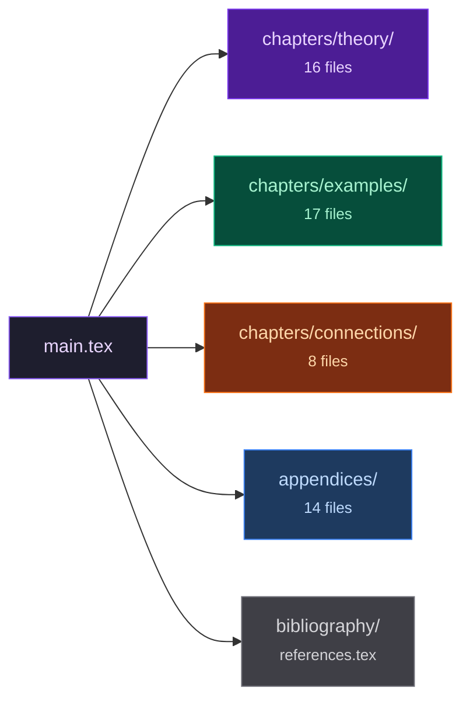

<div align="center">

# Chiral Duality in the Presence of Quantum Corrections

### Geometric Realizations via Configuration Spaces

&nbsp;


&nbsp;

*Logarithmic differential forms on configuration spaces act as diffracting prisms,*
*decomposing chiral algebras across their operadic spectrum.*

&nbsp;


</div>

---

## The Central Construction

The manuscript builds a geometric realization of the bar construction

$$\bar{B}_{\text{geom}} \colon \mathsf{ChirAlg}_X \longrightarrow \mathsf{dgCoalg}_X$$

for chiral algebras on a smooth algebraic curve $X$.
The differential sums residues over boundary divisors
of the Fulton--MacPherson compactification:

$$d_{\text{geom}} = \sum_{D \,\in\, \partial\, \overline{C}_n(X)} (-1)^{|D|} \operatorname{Res}_D$$

Nilpotence $d^2 = 0$ at genus zero follows from the
Arnold--Orlik--Solomon relations. At genus $g \geq 1$,
curvature enters: $d_g^2 = \sum_k t_{g,k} \cdot \mathrm{obs}_k$,
controlled by modular parameters $t_{g,k} \in H^1(\mathcal{M}_g)$
and central obstructions $\mathrm{obs}_k \in Z(\mathcal{A})$.

---

## Architecture

```mermaid
graph TD
    subgraph "Part I &mdash; Theory"
        A["Algebraic Foundations<br/><small>Classical Koszul duality, operads</small>"]
        B["Configuration Spaces<br/><small>FM compactification, Arnold relations</small>"]
        C["Bar-Cobar Construction<br/><small>Geometric bar, d&sup2;=0, Verdier pairing</small>"]
        D["Higher Genus<br/><small>Curved A&infin;, quantum corrections</small>"]
        E["Koszul Pairs &amp; Deformations<br/><small>Chiral modules, Hochschild cohomology</small>"]
    end

    subgraph "Part II &mdash; Examples"
        F["Free Fields<br/><small>Heisenberg, fermions, &beta;&gamma;</small>"]
        G["Kac-Moody &amp; W-Algebras<br/><small>Affine, Virasoro, W&#8358;</small>"]
        H["Advanced<br/><small>Yangians, toroidal, deformation quantization</small>"]
    end

    subgraph "Part III &mdash; Connections"
        I["Physics<br/><small>BV-BRST, Feynman diagrams, AGT</small>"]
    end

    A --> B --> C --> D --> E
    E --> F --> G --> H
    E --> I
    C --> F
    D --> I

    style A fill:#4C1D95,stroke:#7C3AED,color:#E9D5FF
    style B fill:#4C1D95,stroke:#7C3AED,color:#E9D5FF
    style C fill:#312E81,stroke:#6366F1,color:#C7D2FE
    style D fill:#312E81,stroke:#6366F1,color:#C7D2FE
    style E fill:#312E81,stroke:#6366F1,color:#C7D2FE
    style F fill:#064E3B,stroke:#10B981,color:#A7F3D0
    style G fill:#064E3B,stroke:#10B981,color:#A7F3D0
    style H fill:#064E3B,stroke:#10B981,color:#A7F3D0
    style I fill:#7C2D12,stroke:#F97316,color:#FED7AA
```



---

## Key Results

| &ensp; | Theorem | Statement |
|:---:|---------|-----------|
| **A** | **Geometric Bar-Cobar Duality** | Bar and cobar functors via configuration space integrals form an adjoint pair. For Koszul chiral algebras, the adjunction is an equivalence. |
| **B** | **Bar-Cobar Inversion** | $\Omega^{\text{ch}} \circ \bar{B}\_{\text{geom}} \simeq \mathrm{id}$ via spectral sequence collapse at $E_2$. |
| **C** | **Deformation-Obstruction Complementarity** | $Q_g(\mathcal{A}) \oplus Q_g(\mathcal{A}^!) \simeq H^\*(\mathcal{M}\_g,\, Z(\mathcal{A}))$. What one algebra sees as deformation, its dual sees as obstruction. |

Additional results include chiral Poincare duality, explicit computations through degree 5 for Heisenberg, affine Kac--Moody, and $\mathcal{W}$-algebras, and a complete genus expansion framework via the Feynman transform of the modular operad.

---

## Repository Layout



<details>
<summary><b>Part I &mdash; Theory</b> &ensp; <code>chapters/theory/</code></summary>

| File | Subject |
|------|---------|
| `introduction.tex` | Introduction and main results |
| `algebraic_foundations.tex` | Classical Koszul duality, operads, Weiss covers |
| `configuration_spaces.tex` | FM compactification, Arnold relations |
| `bar_cobar_construction.tex` | The core construction |
| `poincare_duality.tex` | Non-abelian Poincare duality |
| `higher_genus.tex` | Extension to all genera |
| `chiral_koszul_pairs.tex` | Curved structures, non-quadratic extensions |
| `koszul_pair_structure.tex` | Pair classification, periodicity |
| `deformation_theory.tex` | Deformation-obstruction theory |
| `chiral_modules.tex` | Module categories, E1 module duality |
| `poincare_duality_quantum.tex` | Quantum Poincare duality |
| `quantum_corrections.tex` | Loop corrections |
| `filtered_curved.tex` | Filtered vs. curved hierarchy |
| `hochschild_cohomology.tex` | Chiral Hochschild, cyclic structure |

</details>

<details>
<summary><b>Part II &mdash; Examples</b> &ensp; <code>chapters/examples/</code></summary>

| File | Subject |
|------|---------|
| `free_fields.tex` | Heisenberg, free fermion, bc system |
| `beta_gamma.tex` | Symplectic bosons |
| `heisenberg_eisenstein.tex` | Eisenstein series, modular forms |
| `kac_moody_framework.tex` | Affine Kac-Moody: screening, Wakimoto |
| `w_algebras_framework.tex` | W-algebra Koszul duality |
| `w3_composite_fields.tex` | W3 Lambda field derivation |
| `minimal_model_fusion.tex` | Verlinde formula, fusion rules |
| `minimal_model_examples.tex` | Fusion tables |
| `w_algebras_deep.tex` | Flag varieties, jet geometry, Toda |
| `deformation_quantization.tex` | Chiral Kontsevich formality |
| `deformation_examples.tex` | Star products, Maurer-Cartan |
| `yangians.tex` | Drinfeld Yangians, Coulomb branches |
| `toroidal_elliptic.tex` | Double affine, elliptic R-matrix |
| `lattice_foundations.tex` | Lattice VOA engine |
| `genus_expansions.tex` | All-genera expansions |
| `detailed_computations.tex` | Degree-by-degree tables |
| `examples_summary.tex` | Master Table of Computed Invariants |

</details>

<details>
<summary><b>Part III &mdash; Connections</b> &ensp; <code>chapters/connections/</code></summary>

| File | Subject |
|------|---------|
| `poincare_computations.tex` | NAP duality computations |
| `feynman_diagrams.tex` | Feynman diagram interpretation |
| `feynman_connection.tex` | Feynman-configuration connection |
| `bv_brst.tex` | BV-BRST formalism |
| `holomorphic_topological.tex` | Holomorphic-topological theories |
| `physical_origins.tex` | 4d/2d, D-branes, AGT |
| `genus_complete.tex` | Universal genus tower |
| `concordance.tex` | Literature concordance |

</details>

<details>
<summary><b>Appendices</b> &ensp; <code>appendices/</code></summary>

| File | Subject |
|------|---------|
| `general_relations.tex` | A-infinity relations, sign formulas |
| `arnold_relations.tex` | Arnold relations |
| `signs_and_shifts.tex` | Koszul signs, suspensions, determinants |
| `sign_conventions.tex` | Loday-Vallette vs. manuscript dictionary |
| `theta_functions.tex` | Theta functions, modular forms |
| `spectral_sequences.tex` | Filtered complexes, convergence |
| `spectral_higher_genus.tex` | Hodge-to-de Rham at higher genus |
| `koszul_reference.tex` | Koszul duality reference |
| `homotopy_transfer.tex` | HTT: SDR, tree formulas, transfer |
| `dual_methodology.tex` | Abstract-concrete methodology |
| `computational_tables.tex` | Computational tables |
| `existence_criteria.tex` | Existence criteria |
| `nilpotent_completion.tex` | Nilpotent completion |
| `notation_index.tex` | Complete notation index |

</details>

---

## Building

> **Requirements:** TeX Live (or equivalent) with `pdflatex`, `memoir`, `ebgaramond`, `newtxmath`, `microtype`, `tikz-cd`, `thmtools`, `mathtools`, `tcolorbox`.

```bash
make              # Full build (3 passes, stable cross-references)
make fast         # Single pass for quick iteration
make watch        # Continuous rebuild on file changes (requires latexmk)
make check        # Halt-on-error validation
make draft        # Draft mode (faster, suppresses images)
make clean        # Remove build artifacts and compiled PDF
make veryclean    # Alias for clean
make count        # Manuscript statistics
```

The entry point is `main.tex`. All chapter files are pulled in via `\include` or `\input`. The build produces `main.pdf`.

**Font options.** The default uses EB Garamond (free) via `pdflatex`. For Adobe Garamond Pro (commercial), uncomment the XeLaTeX/LuaLaTeX font block in `main.tex` and compile with `xelatex` or `lualatex`.

---

## Notation

| Symbol | Meaning |
|--------|---------|
| $\bar{B}\_{\text{geom}}(\mathcal{A})$ | Geometric bar complex |
| $\Omega^{\text{ch}}(\mathcal{C})$ | Chiral cobar complex |
| $\overline{C}\_n(X)$ | Fulton--MacPherson compactification |
| $\eta\_{ij} = d\log(z\_i - z\_j)$ | Logarithmic 1-forms (propagators) |
| $\mathcal{A}^!$ | Koszul dual chiral algebra |
| $k + h^\vee$ | Shifted level (Kac--Moody) |
| $\mathcal{W}\_k(\mathfrak{g})$ | $\mathcal{W}$-algebra at level $k$ |
| $Q\_g(\mathcal{A})$ | Genus-$g$ quantum corrections |

Full notation index: `appendices/notation_index.tex`.

---

## Prerequisites

The reader is assumed familiar with:

- **Operad theory** and Koszul duality &ensp; *(Loday--Vallette, Algebraic Operads)*
- **Vertex/chiral algebras** &ensp; *(Beilinson--Drinfeld, Frenkel--Ben-Zvi)*
- **Configuration spaces** and the Fulton--MacPherson compactification
- **Homological algebra**: $A\_\infty$, $L\_\infty$, spectral sequences, derived categories
- **Moduli of curves** $\overline{\mathcal{M}}\_{g,n}$ and their cohomology

---

<div align="center">

*1021 pages &middot; 55 source files &middot; 61,000 lines of LaTeX*

</div>
