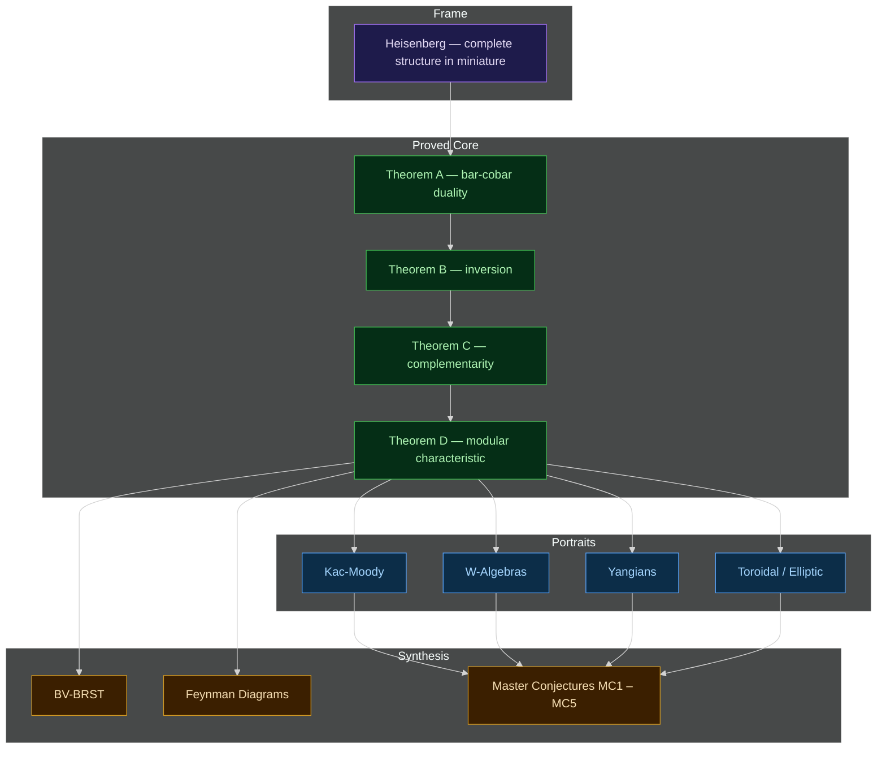

<div align="center">

<br>

# Chiral Duality in the Presence of Quantum Corrections

### Geometric Realizations via Configuration Spaces

<br>

*Logarithmic forms on Fulton&hairsp;-&hairsp;MacPherson compactifications act as diffracting prisms,*
*decomposing chiral algebras across their operadic spectrum.*

<br>


<br>


<br>

</div>

---

<br>

## The Construction

Classical Koszul duality&hairsp;&mdash;&hairsp;the bar-cobar adjunction&hairsp;&mdash;&hairsp;lifts from operads to chiral algebras via configuration space integrals on algebraic curves. The manuscript constructs a geometric bar functor

$$\bar{B}\_{\mathrm{geom}} \colon \mathsf{ChirAlg}\_X \longrightarrow \mathsf{dgCoalg}\_X$$

whose differential sums residues over boundary divisors of the Fulton&ndash;MacPherson compactification $\overline{C}\_n(X)$:

$$d\_{\mathrm{geom}} = \sum\_{D \,\in\, \partial\, \overline{C}\_n(X)} (-1)^{|D|}\, \operatorname{Res}\_D$$

At genus zero, nilpotence $d^2 = 0$ follows from the Arnold&ndash;Orlik&ndash;Solomon relations. At genus $g \geq 1$, curvature enters:

$$d\_{\mathrm{fib}}^2 \;=\; \kappa(\mathcal{A}) \cdot \omega\_g \cdot \mathrm{id}$$

controlled by the Koszul curvature $\kappa(\mathcal{A})$ and the Hodge class $\omega\_g \in H^1(\overline{\mathcal{M}}\_g)$. A corrected total differential $D\_g$ with $D\_g^2 = 0$ is constructed explicitly via the modular operad structure.

<br>

## Main Theorems

Four proved theorems form the core.

| &ensp; | Theorem | Statement |
|:---:|---------|-----------|
| **A** | **Geometric Bar-Cobar Duality** | Bar and cobar functors via configuration space integrals form an adjoint pair. For Koszul chiral algebras, the adjunction is an equivalence. |
| **B** | **Bar-Cobar Inversion** | $\Omega^{\mathrm{ch}} \circ \bar{B}\_{\mathrm{geom}} \simeq \mathrm{id}$ on the Koszul locus, via spectral sequence collapse at $E\_2$. |
| **C** | **Deformation-Obstruction Complementarity** | $Q\_g(\mathcal{A}) \oplus Q\_g(\mathcal{A}^!) \;\simeq\; H^\*(\overline{\mathcal{M}}\_g,\, Z(\mathcal{A}))$. &ensp; What one algebra sees as deformation, its dual sees as obstruction. |
| **D** | **Modular Characteristic** | A single invariant $\kappa(\mathcal{A})$ controls the scalar modular package across all genera: universal, additive under tensor product, antisymmetric under duality ($\kappa + \kappa^! = 0$), with generating function the $\hat{A}$-genus. |

<br>

### Theorem Architecture

These decompose into a finer proved structure.

| Component | Name | Content |
|:---------:|------|---------|
| **A<sub>0</sub>** | Fundamental twisting morphisms | Four-way equivalence: twisting morphisms, bar, cobar, Koszul duality |
| **A<sub>1</sub>** | Bar concentration | $H^{p,q}(\bar{B}(\mathcal{A})) = 0$ for $q \neq 0$ on the Koszul locus |
| **A<sub>2</sub>** | Verdier intertwining | $\mathbb{D}\_{\mathrm{Ran}}\, \bar{B}(\mathcal{A}) \simeq \bar{B}(\mathcal{A}^!)$ |
| **B** | Higher-genus inversion | Quasi-isomorphism on Koszul locus; coderived persistence off it |
| **C<sub>0</sub>** | Fiber-center identification | $R^q \pi\_\* \bar{B}\_g = 0$ for $q \neq 0$;&ensp; $R^0 \pi\_\* \simeq Z(\mathcal{A})$ |
| **C<sub>1</sub>** | Complementarity | Lagrangian polarization of the genus-$g$ correction space |
| **D<sub>scal</sub>** | Scalar characteristic | $\kappa(\mathcal{A})$ determines the full scalar modular package |
| **D<sub>&Delta;</sub>** | Spectral characteristic | Spectral discriminant $\Delta\_{\mathcal{A}}(x)$ from quadratic OPE data |
| **H** | Hochschild duality | $\mathrm{HH}^n(\mathcal{A}) \cong \mathrm{HH}^{2-n}(\mathcal{A}^!)^\vee \otimes \omega\_X$ |

<br>

## Proof Status

The monograph is a two-stratum work.

> **Stratum I&ensp;&mdash;&ensp;proved.**&ensp; Theorems A/B/C, D<sub>scal</sub>, D<sub>&Delta;</sub>, chain-level Drinfeld&ndash;Kohno, all-genera PBW concentration for Kac&ndash;Moody.
> 1,141 proved claims&ensp;(797 here&hairsp;+&hairsp;344 elsewhere).&ensp; Zero open claims.

> **Stratum II&ensp;&mdash;&ensp;programme.**&ensp; Full universal $\Theta\_{\mathcal{A}}$, coderived Ran extension, factorization-categorical DK, periodicity synchronization.
> 153 precisely scoped conjectures organized under five master conjectures.

<br>

### Master Conjectures

| &ensp; | Target | Status | Impact |
|:---:|--------|--------|--------|
| **MC1** | Higher-genus PBW degeneration | Kac&ndash;Moody:&ensp;**proved**&ensp;(all genera). &ensp;Virasoro, $\mathcal{W}\_N$:&ensp;open. | Unconditional interacting families |
| **MC2** | Cyclic $L\_\infty$ &hairsp;+&hairsp; universal $\Theta\_{\mathcal{A}}$ | Open | Full modular homotopy package |
| **MC3** | Factorization Drinfeld&ndash;Kohno / Kazhdan&ndash;Lusztig | Open | Quantum groups completion |
| **MC4** | Completed bar for $\infty$-generators | Open | $\mathcal{W}\_\infty$ and Yangian towers |
| **MC5** | BV-BRST = bar at all genera | Open&ensp;(downstream) | Physics completion |

<br>

## Architecture


```mermaid
%%{init:{'theme':'dark'}}%%
graph TD
    subgraph FA["Frame"]
        F1["Heisenberg &mdash; complete structure in miniature"]
    end

    subgraph CB["Proved Core"]
        C1["Theorem A &mdash; bar-cobar duality"]
        C2["Theorem B &mdash; inversion"]
        C3["Theorem C &mdash; complementarity"]
        C4["Theorem D &mdash; modular characteristic"]
    end

    subgraph PO["Portraits"]
        P1["Kac-Moody"]
        P2["W-Algebras"]
        P3["Yangians"]
        P4["Toroidal / Elliptic"]
    end

    subgraph SY["Synthesis"]
        S1["BV-BRST"]
        S2["Feynman Diagrams"]
        S3["Master Conjectures MC1 &ndash; MC5"]
    end

    F1 --> C1
    C1 --> C2 --> C3 --> C4
    C4 --> P1 & P2 & P3 & P4
    P1 & P2 & P3 & P4 --> S3
    C4 --> S1 & S2

    style F1 fill:#1e1b4b,stroke:#a371f7,color:#e2d9f3
    style C1 fill:#052e16,stroke:#3fb950,color:#aff5b4
    style C2 fill:#052e16,stroke:#3fb950,color:#aff5b4
    style C3 fill:#052e16,stroke:#3fb950,color:#aff5b4
    style C4 fill:#052e16,stroke:#3fb950,color:#aff5b4
    style P1 fill:#0c2d48,stroke:#58a6ff,color:#a5d6ff
    style P2 fill:#0c2d48,stroke:#58a6ff,color:#a5d6ff
    style P3 fill:#0c2d48,stroke:#58a6ff,color:#a5d6ff
    style P4 fill:#0c2d48,stroke:#58a6ff,color:#a5d6ff
    style S1 fill:#3b1f00,stroke:#d29922,color:#f5deb3
    style S2 fill:#3b1f00,stroke:#d29922,color:#f5deb3
    style S3 fill:#3b1f00,stroke:#d29922,color:#f5deb3
```

<br>

## Repository Layout

```
chiral-bar-cobar/
├── main.tex                            entry point
├── chapters/
│   ├── frame/                          Heisenberg as frame example
│   ├── theory/                         core theory (21 files)
│   ├── examples/                       complete portraits (22 files)
│   └── connections/                    synthesis and programme (9 files)
├── appendices/                         reference appendices (15 files)
├── bibliography/references.tex         254 entries
└── compute/
    ├── lib/                            verification engine (46 modules)
    └── tests/                          1,484 tests
```

<details>
<summary><b>Frame</b> &ensp; <code>chapters/frame/</code> &ensp; 1 file</summary>

&nbsp;

| File | Subject |
|------|---------|
| `heisenberg_frame.tex` | Heisenberg algebra as the complete structure in miniature |

</details>

<details>
<summary><b>Theory</b> &ensp; <code>chapters/theory/</code> &ensp; 21 files</summary>

&nbsp;

| File | Subject |
|------|---------|
| `introduction.tex` | Main results, Leitfaden, dictionary |
| `algebraic_foundations.tex` | Classical Koszul duality, operads, Weiss covers |
| `configuration_spaces.tex` | FM compactification, Arnold&ndash;Orlik&ndash;Solomon algebra |
| `bar_cobar_construction.tex` | Geometric bar/cobar, $d^2=0$, Verdier pairing |
| `poincare_duality.tex` | Non-abelian Poincar&eacute; duality |
| `poincare_duality_quantum.tex` | Quantum corrections via modular operad |
| `higher_genus.tex` | Genus-$g$ bar complex, Theorems B and C |
| `chiral_koszul_pairs.tex` | Koszul pair theory, chiral Koszulness criteria |
| `koszul_pair_structure.tex` | Pair classification, periodicity |
| `chiral_modules.tex` | Module categories, $E_1$ module Koszul duality |
| `deformation_theory.tex` | Deformation-obstruction theory, curved $A_\infty$ |
| `hochschild_cohomology.tex` | Chiral Hochschild and cyclic cohomology |
| `quantum_corrections.tex` | Loop correction formulas |
| `filtered_curved.tex` | Filtered vs. curved hierarchy |
| `en_koszul_duality.tex` | $E_n$ Koszul duality, higher-dimensional propagators |
| `derived_langlands.tex` | Derived Langlands, critical-level oper bar |

</details>

<details>
<summary><b>Examples</b> &ensp; <code>chapters/examples/</code> &ensp; 22 files</summary>

&nbsp;

| File | Subject |
|------|---------|
| `lattice_foundations.tex` | Lattice VOA engine |
| `free_fields.tex` | Heisenberg, free fermion, bc system |
| `beta_gamma.tex` | Symplectic bosons, $\beta\gamma$ bar complex |
| `heisenberg_eisenstein.tex` | Heisenberg genus expansion, Eisenstein series |
| `kac_moody_framework.tex` | Affine Kac&ndash;Moody: screening, Wakimoto, admissible levels |
| `w_algebras_framework.tex` | $\mathcal{W}$-algebra Koszul duality |
| `w3_composite_fields.tex` | $\mathcal{W}_3$ composite $\Lambda$ field, null vectors, Kac determinant |
| `w_algebras_deep.tex` | $\mathcal{W}_3$ bar complex, Bershadsky&ndash;Polyakov, DS hierarchy |
| `minimal_model_fusion.tex` | Verlinde formula, fusion rules, modular tensor categories |
| `minimal_model_examples.tex` | Ising, tricritical Ising, three-state Potts |
| `deformation_quantization.tex` | Chiral Kontsevich formality |
| `deformation_examples.tex` | Star products, Maurer&ndash;Cartan elements |
| `yangians.tex` | Drinfeld Yangians, $E_1$ structure, Coulomb branches |
| `toroidal_elliptic.tex` | Double affine algebras, elliptic R-matrix |
| `genus_expansions.tex` | All-genera expansions for major families |
| `detailed_computations.tex` | Degree-by-degree tables through weight 5 |
| `examples_summary.tex` | Master Table of Computed Invariants |

</details>

<details>
<summary><b>Connections</b> &ensp; <code>chapters/connections/</code> &ensp; 9 files</summary>

&nbsp;

| File | Subject |
|------|---------|
| `poincare_computations.tex` | Non-abelian Poincar&eacute; duality computations |
| `feynman_diagrams.tex` | Feynman diagram interpretation |
| `feynman_connection.tex` | Feynman&ndash;configuration space bridge |
| `bv_brst.tex` | BV-BRST formalism: bar = BRST at genus 0 |
| `holomorphic_topological.tex` | Holomorphic-topological theories, AGT |
| `physical_origins.tex` | 4d/2d, D-branes, non-commutative Chern&ndash;Simons |
| `kontsevich_integral.tex` | Kontsevich integral, Vassiliev invariants |
| `genus_complete.tex` | Universal genus tower, Eynard&ndash;Orantin recursion |
| `concordance.tex` | Literature concordance and status ledger |

</details>

<details>
<summary><b>Appendices</b> &ensp; <code>appendices/</code> &ensp; 15 files</summary>

&nbsp;

| File | Subject |
|------|---------|
| `general_relations.tex` | $A_\infty$ relations, sign formulas |
| `arnold_relations.tex` | Arnold relations and their consequences |
| `signs_and_shifts.tex` | Koszul signs, suspensions, determinants |
| `sign_conventions.tex` | Loday&ndash;Vallette vs. manuscript dictionary |
| `theta_functions.tex` | Theta functions, modular forms |
| `spectral_sequences.tex` | Filtered complexes, convergence theorems |
| `spectral_higher_genus.tex` | Hodge-to-de Rham at higher genus |
| `koszul_reference.tex` | Koszul duality reference tables |
| `homotopy_transfer.tex` | Homotopy transfer: SDR, tree formulas |
| `dual_methodology.tex` | Abstract-concrete methodology |
| `computational_tables.tex` | Computational tables |
| `existence_criteria.tex` | Existence criteria for duality structures |
| `nilpotent_completion.tex` | Nilpotent and pronilpotent completion |
| `coderived_models.tex` | Coderived and contraderived model structures |
| `notation_index.tex` | Complete notation index |

</details>

<br>

## Building

> **Requirements**:&ensp; TeX Live 2024+ with `pdflatex`, `memoir`, `ebgaramond`, `newtxmath`, `microtype`, `tikz-cd`, `thmtools`, `mathtools`, `tcolorbox`.

| Command | Description |
|---------|-------------|
| <kbd>make</kbd> | Full build&hairsp;&mdash;&hairsp;up to 6 passes with convergence detection. Stamp-based idempotent. |
| <kbd>make fast</kbd> | Single-pass build&hairsp;&mdash;&hairsp;primary iteration tool. Same idempotency. |
| <kbd>make test</kbd> | Run compute verification suite&hairsp;&mdash;&hairsp;1,484 tests via `pytest`. |
| <kbd>make clean</kbd> | Remove aux/log/toc debris. Preserves PDF and build stamp. |
| <kbd>make veryclean</kbd> | Remove everything including PDF and stamp. Forces full rebuild. |
| <kbd>make count</kbd> | Manuscript statistics. |
| <kbd>make census</kbd> | Claim status census across all source files. |

Entry point is `main.tex`. Build produces `main.pdf`.

> [!IMPORTANT]
> A file-watcher may spawn competing `pdflatex` processes on save. Kill before manual builds:&ensp;`pkill -f pdflatex`

**Fonts.**&ensp; Default: EB Garamond (free) via `pdflatex`. For Adobe Garamond Pro, uncomment the XeLaTeX block in `main.tex` and compile with `xelatex` or `lualatex`.

<br>

## Compute Engine

A Python verification engine independently checks the manuscript's claims.


<details>
<summary><b>Module catalogue</b></summary>

&nbsp;

| Group | Modules | Verifies |
|-------|---------|----------|
| **Bar complexes** | `bar_complex` `chiral_bar` `bar_comparison` `bar_modular` `bar_gf_solver` | Bar differential, $d^2 = 0$, generating functions |
| **Kac-Moody** | `km_bar_differential` `genus1_pbw_sl2` | KM bar bicomplex, genus-1 PBW concentration |
| **Virasoro** | `virasoro_bar` `virasoro_ainfty` `virasoro_pbw_genus1` | Virasoro bar cohomology, $A_\infty$ structure |
| **W-algebras** | `w3_bar_extended` `w_algebra_pbw_genus1` `w_infinity_ope` `w_infinity_support_complex` | $\mathcal{W}_3$ composites, PBW, $\mathcal{W}_\infty$ OPE |
| **Free fields** | `heisenberg_bar` `fermion_bar` `betagamma_bar` `e8_lattice_bar` | Family-specific bar cohomology |
| **Other algebras** | `sl3_bar` `nonsimplylaced_bar` `minimal_model_bar` `toroidal_bar` | $\mathfrak{sl}_3$, non-simply-laced, minimal models, toroidal |
| **DS reduction** | `ds_reduction` `nonprincipal_ds_reduction` `nonprincipal_ds_normalization` `nonprincipal_ds_orbits` | Drinfeld&ndash;Sokolov reduction, non-principal orbits |
| **Genus** | `genus_bridge` `genus_expansion` `curvature_genus_bridge` `deformation_bar` | Genus tower, curvature mechanism |
| **Koszul & spectral** | `koszul_hilbert` `koszul_pairs` `spectral_sequence` | Hilbert series, Koszul recognition |
| **BV & specialized** | `bv_brst` `bv_duality` `pronilpotent_bar` `cross_algebra` `chiral_invariant_machine` | BV formalism, pronilpotent completion |
| **Infrastructure** | `lie_algebra` `os_algebra` `fm_compactification` `htt` `utils` | Lie algebra data, Arnold relations, FM geometry |

</details>

```bash
cd compute && .venv/bin/python -m pytest tests/ -q
```

<br>

## Notation

| Symbol | Meaning |
|--------|---------|
| $\bar{B}\_{\mathrm{geom}}(\mathcal{A})$ | Geometric bar complex |
| $\Omega^{\mathrm{ch}}(\mathcal{C})$ | Chiral cobar complex |
| $\overline{C}\_n(X)$ | Fulton&ndash;MacPherson compactification |
| $\eta\_{ij} = d\!\log(z\_i - z\_j)$ | Logarithmic 1-forms (propagators) |
| $\mathcal{A}^!$ | Koszul dual chiral algebra |
| $\kappa(\mathcal{A})$ | Koszul curvature invariant |
| $\Delta\_{\mathcal{A}}(x)$ | Spectral discriminant |
| $\Theta\_{\mathcal{A}}$ | Universal Maurer&ndash;Cartan class&ensp;*(conjectural)* |
| $k + h^\vee$ | Shifted level (Kac&ndash;Moody) |
| $\mathcal{W}\_k(\mathfrak{g})$ | $\mathcal{W}$-algebra at level $k$ |
| $Q\_g(\mathcal{A})$ | Genus-$g$ quantum corrections |

Full notation index:&ensp;`appendices/notation_index.tex`.

<br>

## Prerequisites

Familiarity assumed with:

- **Operad theory** and Koszul duality&ensp;*(Loday&ndash;Vallette, Algebraic Operads)*
- **Vertex and chiral algebras**&ensp;*(Beilinson&ndash;Drinfeld, Frenkel&ndash;Ben-Zvi)*
- **Configuration spaces** and Fulton&ndash;MacPherson compactifications
- **Homological algebra**:&ensp;$A\_\infty$, $L\_\infty$, spectral sequences, derived categories
- **Moduli of curves**&ensp;$\overline{\mathcal{M}}\_{g,n}$ and their cohomology

<br>

---

<div align="center">

<sub>1,417 pages&ensp;&middot;&ensp;89,000 lines of LaTeX&ensp;&middot;&ensp;68 source files&ensp;&middot;&ensp;254 references&ensp;&middot;&ensp;19,000 lines of Python</sub>

</div>
